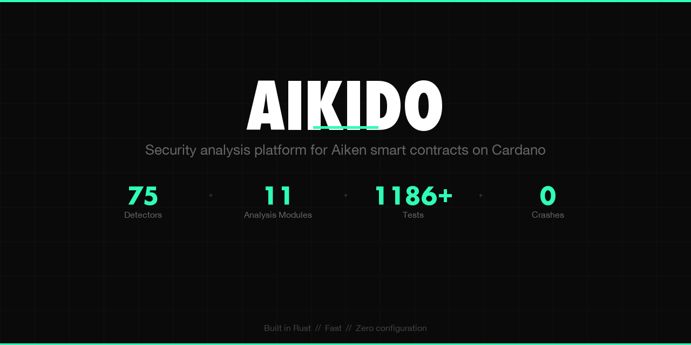
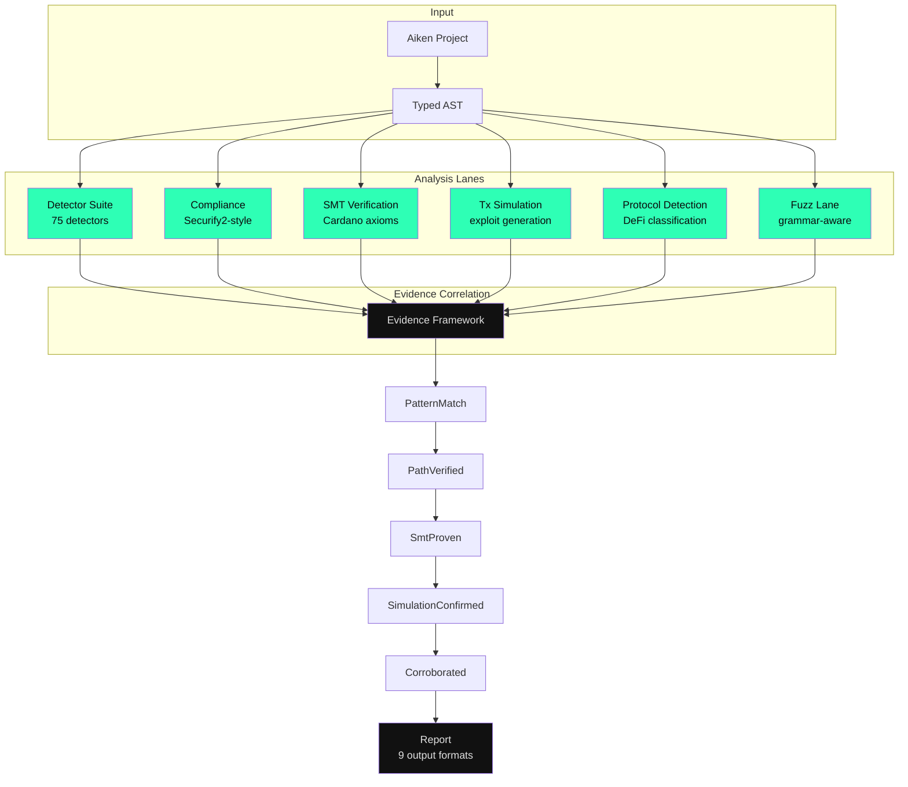

<p align="center">
  
</p>

<p align="center">
  <a href="LICENSE"></a>
  
  
  
  
  
</p>

---

**Security analysis platform for [Aiken](https://aiken-lang.org/) smart contracts on Cardano.**

Aikido goes beyond static analysis. It combines a 75-detector suite with SMT verification, transaction simulation, compliance analysis, protocol pattern detection, and grammar-aware fuzzing to find vulnerabilities in Aiken smart contracts before they reach mainnet. Multi-lane analysis cross-correlates evidence across techniques, producing findings with source context, severity ratings, CWE/CWC classifications, and actionable remediation guidance.

Built in Rust. Fast. Zero configuration required.

---

## Why Aikido

Cardano smart contracts are immutable once deployed. A vulnerability in production means lost funds with no recourse. Manual audits are expensive, slow, and bottlenecked. Aikido catches the classes of bugs that auditors find most often - double satisfaction, missing signature checks, unbounded iteration, unsafe datum handling - automatically, in seconds.

- **The only security tool for Aiken** - no alternatives exist in the ecosystem
- **75 detectors** with CWC (Cardano Weakness Classification) and CWE mappings
- **Multi-lane analysis** - static detectors, compliance, SMT verification, transaction simulation, protocol detection, fuzzing
- **Validated against professional audit** - 85% coverage on TxPipe's Strike Finance audit findings ([full comparison](AUDIT_COMPARISON.md))
- **Evidence framework** - findings corroborated across multiple analysis techniques (PatternMatch -> SmtProven -> SimulationConfirmed)
- **9 output formats** - terminal, JSON, SARIF, Markdown, HTML, PDF, CSV, GitLab SAST, reviewdog
- **Ecosystem proven** - 10+ real-world projects including SundaeSwap, Anastasia Labs, Strike Finance, and Seedelf (0 crashes)

---

## Quick Start

### Install

```bash
# Homebrew (macOS/Linux)
brew install Bajuzjefe/tap/aikido

# Cargo (Rust >= 1.88.0)
cargo install --git https://github.com/Bajuzjefe/Aikido-Security-Analysis-Platform aikido-cli

# npm (wrapper)
npx aikido-aiken /path/to/project

# Docker
docker run --rm -v $(pwd):/project ghcr.io/bajuzjefe/aikido:0.3.1 /project

# From source
git clone https://github.com/Bajuzjefe/Aikido-Security-Analysis-Platform.git
cd aikido && cargo build --release
```

### Run

```bash
aikido /path/to/your-aiken-project
```

### Example Output

```
━━━━━━━━━━━━━━━━━━━━━━━━━━━━━━━━━━━━━━━━━━━━━━━━━━
  AIKIDO v0.3.1  Static Analysis Report
  Project: test/simple-treasury v0.1.0
━━━━━━━━━━━━━━━━━━━━━━━━━━━━━━━━━━━━━━━━━━━━━━━━━━

  [CRITICAL] (definite) double-satisfaction - Handler treasury.spend iterates
    outputs without own OutputReference - validators/treasury.ak:23

    Spend handler accesses tx.outputs but never uses __own_ref to identify
    its own input. An attacker can satisfy multiple script inputs with a
    single output, draining funds.

        22 | validator treasury {
    >   23 |   spend(
    >   24 |     datum: Option<TreasuryDatum>,
    >   25 |     redeemer: TreasuryRedeemer,

    Suggestion: Use the OutputReference parameter to correlate outputs
    to this specific input.

  ...

  1 critical, 5 high, 7 medium, 0 low, 0 info
━━━━━━━━━━━━━━━━━━━━━━━━━━━━━━━━━━━━━━━━━━━━━━━━━━
```

---

## Analysis Architecture

Aikido uses a multi-lane approach where independent analysis techniques cross-validate each other:



### Lane Details

| Lane | What it does |
|------|-------------|
| **Detector Suite** | Cross-module interprocedural analysis, taint tracking, symbolic execution, delegation-aware suppression, transitive signal merging, datum continuity tracking |
| **Compliance** | Securify2-style dual-pattern system: every security property has compliance (safe) and violation (unsafe) patterns. 10 security property variants |
| **SMT Verification** | Solver-independent interface with Cardano domain axioms (value conservation, signature semantics, minting policy). Constraint solving for reachability |
| **Tx Simulation** | ScriptContext builder generates concrete exploit scenarios. Tests 6 detector categories against simulated transactions |
| **Protocol Detection** | Automatic DeFi protocol classification (DEX, Lending, Staking, DAO, NFT, Options, Escrow). Token flow and authority analysis |
| **Fuzz Lane** | Grammar-aware Cardano transaction generation, Echidna-style stateful protocol fuzzing, deterministic PRNG |

Supporting modules: **CWC Registry** (30 entries mapping all 75 detectors), **Scorecard** (Experimental -> Beta -> Stable promotion with quality gates), **SSA IR** (phi nodes, dominators, use-def chains).

---

## Real-World Validation

### Strike Finance Audit Comparison

Aikido was benchmarked against TxPipe's professional audit of Strike Finance (perpetuals + forwards contracts):

| Metric | Result |
|--------|--------|
| TxPipe security findings analyzed | 24 |
| Full match (true positive) | 12 |
| Partial match | 5 |
| Correctly not flagged (code fixed) | 4 |
| False negatives | 3 |
| Aikido unique findings | 26 |
| **Coverage (unfixed findings)** | **85%** |

Full methodology and per-finding breakdown: **[AUDIT_COMPARISON.md](AUDIT_COMPARISON.md)**

### Ecosystem Validation

Validated against **10+ real-world Aiken smart contract projects** with **zero crashes**:

| Project | Findings | Severity Distribution |
|---------|----------|-----------------------|
| SundaeSwap DEX | 47 | 1 critical, 13 high, 24 medium, 3 low, 6 info |
| Anastasia Design Patterns | 24 | 3 critical, 10 high, 8 medium, 2 low, 1 info |
| Anastasia Multisig | 6 | 2 critical, 4 medium |
| Seedelf Wallet | 4 | 1 high, 2 medium, 1 low |
| Strike Finance (4 repos) | 75 | 5 critical, 18 high, 40 medium, 8 low, 4 info |
| Acca | 20 | 20 medium |
| **Total** | **176** | **81% estimated true positive rate** |

---

## Detectors

75 detectors mapped to CWE identifiers.

<details>
<summary><strong>Critical (5)</strong></summary>

| Detector | CWE | Description |
|----------|-----|-------------|
| `double-satisfaction` | CWE-362 | Spend handler iterates outputs without referencing own input |
| `missing-minting-policy-check` | CWE-862 | Mint handler doesn't validate which token names are minted |
| `missing-utxo-authentication` | CWE-345 | Reference inputs used without authentication |
| `unrestricted-minting` | CWE-862 | Minting policy with no authorization check at all |
| `output-address-not-validated` | CWE-20 | Outputs sent to unchecked addresses |

</details>

<details>
<summary><strong>High (19)</strong></summary>

| Detector | CWE | Description |
|----------|-----|-------------|
| `missing-redeemer-validation` | CWE-20 | Catch-all redeemer pattern trivially returns True |
| `missing-signature-check` | CWE-862 | Authority datum fields with no `extra_signatories` check |
| `unsafe-datum-deconstruction` | CWE-252 | Option datum not safely deconstructed with `expect Some` |
| `missing-datum-in-script-output` | CWE-404 | Script output without datum attachment (funds locked forever) |
| `arbitrary-datum-in-output` | CWE-20 | Outputs produced without validating datum correctness |
| `division-by-zero-risk` | CWE-369 | Division with attacker-controlled denominator |
| `token-name-not-validated` | CWE-20 | Mint policy checks auth but not token names |
| `value-not-preserved` | CWE-682 | Spend handler doesn't verify output value >= input value |
| `unsafe-match-comparison` | CWE-697 | Value compared with match instead of structural equality |
| `integer-underflow-risk` | CWE-191 | Subtraction on redeemer-controlled values |
| `quantity-of-double-counting` | CWE-682 | Token quantity checked without isolating input vs output |
| `state-transition-integrity` | CWE-20 | Redeemer actions without datum transition validation |
| `withdraw-zero-trick` | CWE-863 | Withdraw handler exploitable with zero-value withdrawal |
| `other-token-minting` | CWE-862 | Mint policy allows minting tokens beyond intended scope |
| `unsafe-redeemer-arithmetic` | CWE-682 | Arithmetic on redeemer-tainted values without bounds |
| `value-preservation-gap` | CWE-682 | Lovelace checked but native assets not preserved |
| `uncoordinated-multi-validator` | CWE-362 | Multi-handler validator without cross-handler coordination |
| `missing-burn-verification` | CWE-862 | Token burning without proper verification |
| `oracle-manipulation-risk` | CWE-20 | Oracle data used without manipulation safeguards |

</details>

<details>
<summary><strong>Medium (24)</strong></summary>

| Detector | CWE | Description |
|----------|-----|-------------|
| `missing-validity-range` | CWE-613 | Time-sensitive datum without validity_range check |
| `insufficient-staking-control` | CWE-863 | Outputs don't constrain staking credential |
| `unbounded-datum-size` | CWE-400 | Datum fields with unbounded types (List, ByteArray) |
| `unbounded-value-size` | CWE-400 | Outputs don't constrain native asset count |
| `unbounded-list-iteration` | CWE-400 | Direct iteration over raw transaction list fields |
| `oracle-freshness-not-checked` | CWE-613 | Oracle data used without recency verification |
| `non-exhaustive-redeemer` | CWE-478 | Redeemer match doesn't cover all constructors |
| `hardcoded-addresses` | CWE-798 | ByteArray literals matching Cardano address lengths |
| `utxo-contention-risk` | CWE-400 | Single global UTXO contention pattern |
| `cheap-spam-vulnerability` | CWE-770 | Validator vulnerable to cheap UTXO spam |
| `unsafe-partial-pattern` | CWE-252 | Expect pattern on non-Option type that may fail at runtime |
| `unconstrained-recursion` | CWE-674 | Self-recursive handler without clear termination |
| `empty-handler-body` | CWE-561 | Handler with no meaningful logic |
| `unsafe-list-head` | CWE-129 | `list.head()` / `list.at()` without length guard |
| `missing-datum-field-validation` | CWE-20 | Spend handler accepts datum fields but never validates them |
| `missing-token-burn` | CWE-862 | Minting policy with no burn handling |
| `missing-state-update` | CWE-665 | State machine without datum update |
| `rounding-error-risk` | CWE-682 | Integer division on financial values |
| `missing-input-credential-check` | CWE-862 | Input iteration without credential check |
| `duplicate-asset-name-risk` | CWE-694 | Minting without unique asset name enforcement |
| `fee-calculation-unchecked` | CWE-682 | Fee or protocol payment without validation |
| `datum-tampering-risk` | CWE-20 | Datum passed through without field-level validation |
| `missing-protocol-token` | CWE-862 | State transition without protocol token verification |
| `unbounded-protocol-operations` | CWE-400 | Both input and output lists iterated without bounds |

</details>

<details>
<summary><strong>Low / Info (12)</strong></summary>

| Detector | Severity | Description |
|----------|----------|-------------|
| `reference-script-injection` | Low | Outputs don't constrain reference_script field |
| `unused-validator-parameter` | Low | Validator parameter never referenced |
| `fail-only-redeemer-branch` | Low | Redeemer branch that always fails |
| `missing-min-ada-check` | Info | Script output without minimum ADA check |
| `dead-code-path` | Low | Unreachable code paths |
| `redundant-check` | Low | Trivially true conditions |
| `shadowed-variable` | Info | Handler parameter shadowed by pattern binding |
| `magic-numbers` | Info | Unexplained numeric literals |
| `excessive-validator-params` | Info | Too many validator parameters |
| `unused-import` | Info | Imported module with no function calls |

</details>

Each detector has detailed documentation with vulnerable examples, safe examples, and remediation guidance. Use `aikido --explain <detector-name>` or see `docs/detectors/`.

---

## Output Formats

9 formats for different workflows:

```bash
aikido /path/to/project                        # Colored terminal output (default)
aikido /path/to/project --format json          # JSON (machine-readable)
aikido /path/to/project --format sarif         # SARIF v2.1.0 (GitHub Code Scanning)
aikido /path/to/project --format markdown      # Markdown report
aikido /path/to/project --format html          # Standalone HTML report
aikido /path/to/project --format pdf           # PDF audit report
aikido /path/to/project --format csv           # CSV export
aikido /path/to/project --format gitlab-sast   # GitLab SAST
aikido /path/to/project --format rdjson        # reviewdog
```

---

## Configuration

### `.aikido.toml`

```toml
# Use a preset as a starting point
extends = "strict"      # or "lenient" for fewer warnings

[detectors]
disable = ["magic-numbers", "unused-import"]

[detectors.severity_override]
unbounded-datum-size = "low"

# Per-file overrides
[[files]]
pattern = "tests/**"
disable = ["hardcoded-addresses", "magic-numbers"]
```

### Inline Suppression

```rust
// aikido:ignore[double-satisfaction] -- false positive: own_ref checked in helper
spend(datum, redeemer, own_ref, tx) {
  ...
}
```

### Baseline Support

```bash
aikido /path --accept-baseline    # Save current findings as baseline
aikido /path                      # Only new findings reported
```

---

## CI/CD Integration

### GitHub Actions

```yaml
name: Security
on: [push, pull_request]
jobs:
  aikido:
    runs-on: ubuntu-latest
    steps:
      - uses: actions/checkout@v4
      - name: Install Aikido
        run: cargo install --git https://github.com/Bajuzjefe/Aikido-Security-Analysis-Platform aikido-cli
      - name: Run analysis
        run: aikido . --format sarif --fail-on high > results.sarif
      - name: Upload SARIF
        if: always()
        uses: github/codeql-action/upload-sarif@v3
        with:
          sarif_file: results.sarif
```

### Docker

```bash
docker run --rm -v $(pwd):/project ghcr.io/bajuzjefe/aikido:0.3.1 /project --format json
```

---

## CLI Reference

```bash
aikido /path                        # Analyze project
aikido /path --fail-on high         # Exit non-zero for high+ findings
aikido /path --min-severity medium  # Filter to medium+ only
aikido /path --verbose              # Include UPLC metrics and budget
aikido /path --list-rules           # Show all detectors
aikido /path --explain <rule>       # Detailed explanation with examples
aikido /path --diff main            # Only report findings in changed files
aikido /path --watch                # Re-run on file changes
aikido /path -q                     # Quiet mode
aikido /path --config my.toml       # Use specific config file
aikido /path --accept-baseline      # Save current findings as baseline
aikido /path --lsp                  # LSP JSON-RPC diagnostics
aikido /path --interactive          # Terminal navigator for findings
aikido /path --fix                  # Insert suppression comments
aikido /path --generate-config      # Generate .aikido.toml from findings
aikido /path --strict-stdlib        # Reject stdlib v1.x (default: warn)
aikido --git <url>                  # Clone and analyze remote repo
aikido --benchmark-manifest benchmarks/local-fixtures.toml --format json
aikido --benchmark-manifest benchmarks/local-fixtures.toml --benchmark-enforce-gates
```

---

## Architecture

```
aikido/
├── crates/
│   ├── aikido-core/           # Library: analysis engine
│   │   ├── src/
│   │   │   ├── project.rs            # Aiken project loading & compilation
│   │   │   ├── ast_walker.rs         # Typed AST traversal -> ModuleInfo
│   │   │   ├── body_analysis.rs      # Handler body signal extraction + taint tracking
│   │   │   ├── call_graph.rs         # Function dependency graph
│   │   │   ├── cross_module.rs       # Cross-module interprocedural analysis
│   │   │   ├── symbolic.rs           # Symbolic execution & constraints
│   │   │   ├── delegation.rs         # Delegation-aware suppression
│   │   │   ├── evidence.rs           # 5-level evidence framework
│   │   │   ├── cwc.rs               # Cardano Weakness Classification registry
│   │   │   ├── scorecard.rs          # Detector quality tracking & promotion
│   │   │   ├── ssa.rs               # SSA IR with phi nodes & use-def chains
│   │   │   ├── compliance.rs         # Securify2-style compliance analysis
│   │   │   ├── smt.rs               # SMT verification with Cardano axioms
│   │   │   ├── path_analysis.rs      # Path-sensitive analysis & CFG
│   │   │   ├── invariant_spec.rs     # .aikido-invariants.toml DSL
│   │   │   ├── protocol_patterns.rs  # DeFi protocol detection & classification
│   │   │   ├── tx_simulation.rs      # ScriptContext builder & exploit generation
│   │   │   ├── fuzz_lane.rs          # Grammar-aware tx fuzzing
│   │   │   ├── config.rs             # .aikido.toml configuration
│   │   │   ├── suppression.rs        # Inline suppression comments
│   │   │   ├── baseline.rs           # Baseline file support
│   │   │   ├── uplc_analysis.rs      # UPLC bytecode analysis & budgets
│   │   │   └── detector/             # 75 detector implementations
│   │   └── tests/                    # 1186+ tests
│   └── aikido-cli/            # Binary: clap-based CLI
├── fixtures/                  # Test contracts (7 fixtures)
├── audits/                    # Audit comparison artifacts
├── docs/detectors/            # Per-detector documentation
├── .github/workflows/         # CI, cross-platform, release, fuzz
├── homebrew/                  # Homebrew formula
├── npm/                       # npm wrapper package
├── vscode-extension/          # VS Code extension
├── fuzz/                      # cargo-fuzz targets
└── Dockerfile                 # Multi-stage build
```

### Building from Source

```bash
git clone https://github.com/Bajuzjefe/Aikido-Security-Analysis-Platform.git
cd aikido
cargo build --release          # Binary at target/release/aikido
cargo test                     # Run test suite (1186+ tests)
cargo clippy --all-targets     # Lint (zero warnings)
```

Requires Rust >= 1.88.0.

---

## Vulnerability Coverage

Detectors are derived from real vulnerabilities found in published Cardano smart contract audits:

| Source | Findings Covered |
|--------|-----------------|
| MLabs audit reports | Double satisfaction, missing minting policy, arbitrary datum, unbounded size |
| Vacuumlabs audit reports | Unbounded value size, token dust attacks |
| [Plutonomicon](https://github.com/Plutonomicon/plutonomicon) | Unrestricted minting, double satisfaction patterns |
| Anastasia Labs audit reports | Staking credential theft, datum handling |
| TxPipe audit reports | Oracle manipulation, state transition integrity, value preservation |
| CWE Database | 75 detectors mapped to specific CWE identifiers |

---

## License

MIT
